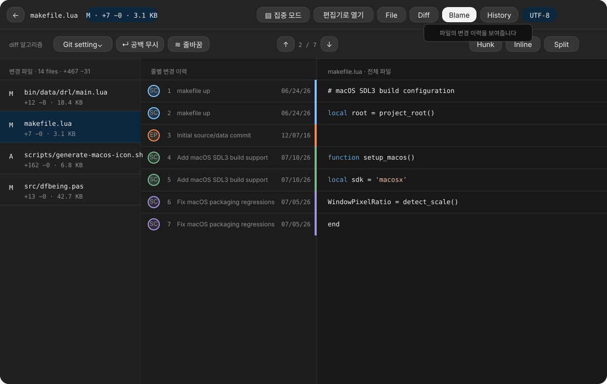

# Full Diff 최종 보완 설계

## 문서의 위치

이 문서는 다음 문서에 이어지는 최종 보완 사항을 정합니다.

- [Full Diff 작업 공간 설계](2026-07-27-full-diff-workspace-design.md)
- [웹 시안 일치 설계](2026-07-27-full-diff-web-mockup-parity-design.md)
- [사용성 보완 설계](2026-07-27-full-diff-usability-followup-design.md)

내용이 충돌하면 이 문서를 우선합니다. 기존 구현 구조와 검증 항목은
유지하고 화면 구성, 파일 정보, History와 Blame에 관한 최신 승인
내용만 바꿉니다.

## 승인 시안



이 이미지는 버튼 위치, 파일 이름 표시, 파일 크기와 Blame 열 구성을
검수하는 기준입니다. 실제 저장소에 따라 달라지는 경로, 커밋 제목,
날짜와 파일 크기는 비교 대상에서 제외합니다.

## 목표

1. Full Diff에서 주변 커밋 열을 없애고 변경 파일과 내용에 집중합니다.
2. 파일 이름을 불필요한 배경 없이 읽기 쉽게 표시합니다.
3. diff 알고리즘의 이름과 현재 선택값을 분리합니다.
4. History의 용도를 마우스를 올렸을 때 바로 알 수 있게 합니다.
5. Blame을 줄별 변경 이력과 전체 소스를 나란히 읽는 화면으로
   바꿉니다.
6. Git 호출을 크게 늘리지 않고 각 파일의 크기를 표시합니다.

## 화면 구성

### 첫 번째 머리글

왼쪽부터 다음 순서로 표시합니다.

1. 타임라인으로 돌아가기
2. 현재 파일 경로
3. 파일 상태, 추가·삭제 수와 파일 크기

오른쪽은 다음 순서입니다.

1. `집중 모드`
2. `편집기로 열기`
3. `File`
4. `Diff`
5. `Blame`
6. `History`
7. 인코딩

`집중 모드`는 `편집기로 열기` 바로 왼쪽에 둡니다. 집중 모드가 켜지면
변경 파일 열을 숨기고 콘텐츠가 남은 너비를 모두 사용합니다.

### 두 번째 머리글

왼쪽부터 다음 세 그룹으로 나눕니다.

1. `diff 알고리즘` 라벨, 현재 선택값 메뉴, `공백 무시`, `줄바꿈`
2. 이전 Hunk, 현재 Hunk 번호, 다음 Hunk
3. `Hunk`, `Inline`, `Split`

`diff 알고리즘`은 메뉴 안에 넣지 않습니다. 라벨은 항상
`diff 알고리즘`으로 보이고 바로 옆 메뉴에는 `Git setting`,
`Histogram`처럼 현재 선택값만 표시합니다. 너비가 부족하면 그룹
단위로 줄을 바꾸되 라벨과 선택값은 붙어 있어야 합니다.

`알고리즘`과 `알고리듬`은 모두 쓰이지만 이 화면에서는 국내 소프트웨어
UI에서 널리 쓰이는 `알고리즘`으로 통일합니다.

선택값 메뉴에 마우스를 올리면 다음 내용을 설명합니다.

- 이 메뉴가 Git의 변경 구간 계산 방식을 고른다는 점
- 현재 선택값
- 선택값이 결과에 미치는 영향

## 본문 열

일반 화면은 변경 파일과 콘텐츠의 두 열만 사용합니다. 사용자가 이미
커밋을 선택해서 들어온 화면이므로 주변 커밋 열은 표시하지 않습니다.

- `File`, `Diff`, `Blame`: 변경 파일 + 콘텐츠
- `History`: 변경 파일 + 파일 History + 선택한 시점의 diff
- 집중 모드: 콘텐츠만 표시

History에서 왼쪽·오른쪽 화살표를 누르면 변경 파일과 History 목록
사이에서 포커스가 이동합니다. 위·아래 화살표는 포커스된 목록의
선택을 옮깁니다. `Cmd+Up`과 `Cmd+Down`은 어느 목록에 포커스가 있어도
변경 파일을 옮깁니다.

## 파일 목록

파일 이름 뒤에 회색 칩이나 별도 배경을 두지 않습니다. 선택한 행의
전체 배경만 기존 선택색으로 바꿉니다. 파일 상태, 이름과 보조 정보는
다음처럼 표시합니다.

```text
M  makefile.lua
   +7 −0 · 3.1 KB
```

글자 크기는 다음 값으로 고정합니다.

| 요소 | 크기 |
|---|---:|
| 파일 이름 | 13px |
| 추가·삭제 수와 파일 크기 | 12px |
| diff 코드 | 12px |
| diff 줄 번호와 기호 | 10px |
| Hunk 제목 | 12px |

파일 경로, 변경 수, 파일 크기, SHA, 줄 번호와 Hunk 범위에는 Menlo
계열 고정폭 글꼴을 사용합니다.

## 파일 크기

파일 크기는 변경 파일 목록과 첫 번째 머리글의 파일 상태 배지에
표시합니다. 값은 결과 쪽 파일의 바이트 크기입니다.

- 커밋된 일반 파일: 대상 커밋의 결과 경로 blob 크기
- 삭제 파일: 선택한 부모의 이전 경로 blob 크기
- 작업 트리 일반 파일: `FileStat.size`
- 작업 트리 심볼릭 링크: 링크 대상 문자열의 UTF-8 바이트 수
- 조회할 수 없는 경우: `—`

커밋 파일은 파일마다 내용을 읽지 않습니다. 대상 커밋과 필요한 부모에
대해 `git ls-tree -rlz`를 경로 묶음으로 실행하고 크기만 읽습니다.
따라서 일반 커밋은 한 번, 삭제 파일이나 이름 변경이 섞여도 최대 두
번의 Git 메타데이터 조회로 끝냅니다.

크기는 1024 단위로 `B`, `KB`, `MB`, `GB`를 사용하고 소수점 한
자리까지만 표시합니다. 10 이상이면 불필요한 소수점은 생략합니다.

## History

History 버튼에 마우스를 올리면 다음 문구를 표시합니다.

> 파일의 변경 이력을 보여줍니다

설명은 버튼 가까이에 비차단 도움말로 표시하고 포인터 입력을 가로막지
않습니다.

History를 열면 현재 파일의 변경 이력과 선택한 시점의 diff를 함께
보여줍니다. 선택한 History 행은 배경과 글자를 반전해 다른
행과 분명히 구분합니다. 키보드 포커스와 확정된 선택은 별도 상태로
관리합니다.

History의 빗금 셀은 자신의 영역에서 반드시 잘라 그립니다. 목록 열,
구분선이나 오른쪽 diff 영역으로 선이 넘어가면 안 됩니다.

## Blame

Blame은 Hunk 머리글과 SHA 약어만 끼워 넣는 현재 방식을 사용하지
않습니다. 전체 파일의 각 소스 행과 같은 높이로 다음 정보를
나란히 표시합니다.

1. 작성자 아바타
2. 파일 줄 번호
3. 커밋 제목
4. 커밋 날짜
5. 커밋을 구분하는 4px 세로 색상선
6. 구문 강조를 적용한 전체 소스

Blame 행에는 `git blame --line-porcelain`에서 이미 받을 수 있는
`author`, `author-mail`, `author-time`, `summary`를 사용합니다.
작성자 정보는 SHA별로 한 번 파싱해 같은 커밋의 반복 행에서
재사용합니다.

원격 아바타 표시가 켜져 있고 기존 `AvatarService`에서 이미지를
얻을 수 있으면 그 이미지를 사용합니다. 원격 조회가 꺼져 있거나
실패하면 작성자 이름의 이니셜을 표시합니다. Blame을 위해 Gravatar나
새 외부 서비스를 추가하지 않습니다.

연속한 행이 같은 커밋이어도 줄 번호와 소스 정렬을 유지합니다. 제목과
날짜는 각 행에 표시하되 공간이 부족하면 제목부터 말줄임합니다.
아바타, 줄 번호와 색상선은 숨기지 않습니다.

Blame에서는 Hunk 머리글을 소스 사이에 삽입하지 않습니다. 활성 Hunk는
기존 미니맵과 현재 행 표시로만 알려 전체 파일의 줄 정렬을 보존합니다.

## 키보드

- `Up`·`Down`: 현재 포커스된 파일 또는 History 목록 이동
- `Cmd+Up`·`Cmd+Down`: 변경 파일 이동
- `Left`·`Right`: History에서 변경 파일과 History 목록 사이 이동
- `Option+Up`·`Option+Down`: 이전·다음 Hunk
- `Cmd+Shift+Up`·`Cmd+Shift+Down`: 콘텐츠를 48px씩 스크롤
- `Cmd+Shift+F`: 집중 모드 전환
- `Esc`: 타임라인으로 돌아가기

메뉴가 열려 있으면 첫 번째 `Esc`는 메뉴를 닫습니다. 그 밖의 경우
`Esc`는 집중 모드 여부와 관계없이 타임라인으로 돌아갑니다.

## 모델과 Git 파싱

`GitFileChange`에 결과 파일 크기를 나타내는 `int? sizeBytes`를
추가합니다. 파일 목록을 읽은 뒤 크기 메타데이터를 합쳐 한 번에
상태를 갱신합니다. 크기 조회가 실패해도 파일 목록과 diff는 그대로
표시하고 크기만 `—`로 둡니다.

`GitBlameLine`에는 다음 값을 추가합니다.

- 작성자 메일
- 작성자 시각
- 커밋 제목

`_parseBlamePorcelain()`은 SHA별 메타데이터 캐시를 두고 여러 행에
반복되는 값을 재사용합니다. 기존 SHA, 작성자와 커밋하지 않은 행
판별은 그대로 유지합니다.

## 오류와 제한

- 파일 크기 조회 실패는 화면 전체 오류로 올리지 않습니다.
- Blame 메타데이터 일부가 없으면 빈 제목, 이니셜과 날짜 없음 상태로
  해당 행을 계속 표시합니다.
- Blame 행 수와 파일 행 수가 다르면 기존처럼 Blame 영역에만 정렬
  오류를 표시합니다.
- 바이너리, 지원하지 않는 인코딩과 크기 제한 파일은 파일 이름,
  상태, 크기와 표시하지 못하는 이유를 함께 보여줍니다.

## 검증

### 위젯 테스트

- `집중 모드`가 `편집기로 열기` 바로 왼쪽에 있는지 확인
- 두 번째 머리글에서 `diff 알고리즘` 라벨과 선택값 버튼이 별도
  요소인지 확인
- History 도움말의 문구와 접근성 설명 확인
- 파일 이름에 칩 배경이 없고 선택한 행 전체에만 배경이 있는지 확인
- 파일 이름, 보조 정보, 코드, 줄 번호와 Hunk 제목의 글자 크기 확인
- 일반 화면에 주변 커밋 열이 없는지 확인
- History의 반전 선택, 포커스 이동과 빗금 잘림 확인
- Blame 열 순서, 소스 줄 정렬, 제목 말줄임과 이니셜 대체 표시 확인

### Git·모델 테스트

- 수정·추가·삭제·이름 변경 파일의 크기와 경로 매핑
- 일반 커밋은 한 번, 부모 조회가 필요해도 두 번을 넘지 않는 크기
  메타데이터 호출
- 공백과 특수 문자가 있는 경로의 NUL 구분 파싱
- 파일 크기 조회 실패 뒤 파일 목록 유지
- Blame의 작성자 메일, 시각과 제목 파싱
- 같은 SHA가 여러 행에 반복될 때 메타데이터 재사용
- 커밋하지 않은 행과 메타데이터가 빠진 행의 대체 표시

### 시각 검수

승인 시안을 기준으로 다음 상태를 같은 창 크기에서 캡처합니다.

1. 기본 Diff와 파일 크기
2. History 도움말과 선택 반전
3. Blame 전체 파일
4. 집중 모드
5. 650px와 480px 반응형 화면

버튼 순서, 알고리즘 라벨 분리, 파일 이름 배경, Blame 열의 경계와
글자 크기가 시안과 1px보다 크게 다르면 실패로 봅니다. 저장소 데이터에
따라 바뀌는 문자열과 파일 크기는 비교하지 않습니다.

## 완료 기준

- `집중 모드`가 첫 번째 머리글에서 `편집기로 열기` 바로 왼쪽에
  표시됩니다.
- `diff 알고리즘`과 현재 선택값 메뉴가 분리되어 보입니다.
- 파일 이름에 회색 배경이 없고 파일 크기가 변경 통계와 함께
  표시됩니다.
- History 도움말, 반전 선택과 키보드 이동이 동작합니다.
- Blame에서 줄별 변경 이력과 구문 강조된 전체 파일이 나란히
  정렬됩니다.
- 주변 커밋 없이 변경 파일과 콘텐츠만 표시됩니다.
- 전체 테스트, 정적 분석, 시각 검수와 macOS 릴리스 빌드가
  통과합니다.
