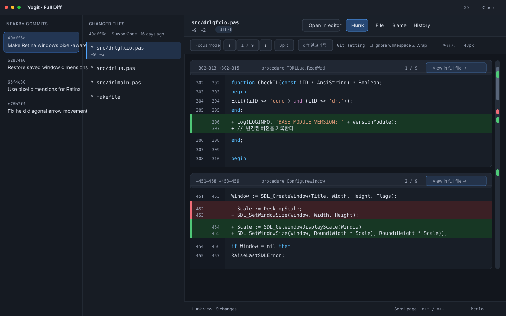
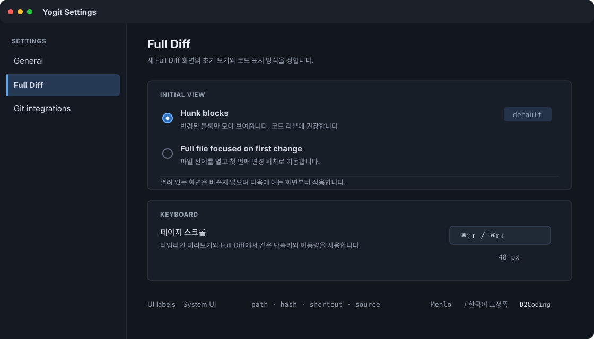

# Full Diff 작업 화면 설계

## 목표

Yogit의 빠른 커밋·파일 탐색은 유지하면서 Full Diff 화면을 코드 리뷰
작업 공간으로 확장합니다.

기본 화면에는 변경된 Hunk를 블록 단위로 모아 보여줍니다. 각 Hunk에서는
파일 전체를 열 수 있으므로 Inline 모드를 따로 두지 않습니다. Settings에서는
Full Diff 화면을 열 때 Hunk 목록부터 보여줄지, 전체 파일을 열고 첫 번째
변경 위치에 초점을 맞출지 선택할 수 있습니다.

## 확정된 콘텐츠 모드

파일 머리글에는 다음 네 가지 주요 모드를 표시합니다.

- `Hunk`
- `File`
- `Blame`
- `History`

Inline이라는 이름의 모드는 따로 두지 않습니다.

### Hunk

Hunk는 기본 모드이자 코드 리뷰의 중심 화면입니다. Git에서 읽은 Hunk
하나를 선택 가능한 블록 하나로 표시하며 각 블록에는 다음 내용을
담습니다.

- 이전 파일과 새 파일의 줄 범위를 읽기 쉽게 정리한 제목
- Git이 제공하는 변경 앞뒤 문맥 3줄
- 추가·삭제된 행
- `2 / 7`과 같은 현재 변경 위치
- `View in full file` 동작

`diff --git`, `index`, `---`, `+++`, `@@` 같은 원본 patch 정보는 모델에
보관하지만 소스 행으로 그리지 않습니다. Hunk 제목에는 원본 정보에서
읽어 낸 줄 범위와 함수 문맥을 대신 표시합니다.

`View in full file`을 선택하면 File 모드로 바뀌고 전체 파일에서 해당
Hunk의 첫 번째 변경 행에 초점을 맞춥니다. 다시 Hunk 모드로 돌아오면
이전에 보던 Hunk 블록이 그대로 선택됩니다.

Hunk의 기본 표시는 한 줄 흐름으로 구성합니다. `Split`을 켜면 삭제와
추가 내용을 양쪽 열에 짝지어 보여줍니다. Split은 Hunk를 보여주는
방식이며 별도의 콘텐츠 모드는 아닙니다.

### File

File은 현재 비교 결과에 해당하는 파일 전체를 보여줍니다. 추가되거나
대체된 결과 행에는 옅은 배경색을 유지합니다. 완전히 삭제된 부분은 결과
파일에 대응하는 행이 없으므로 앞뒤에 남아 있는 행 사이에 삭제 표시를
넣고 그 위치에 초점을 맞춥니다. 파일 자체가 삭제된 커밋이라면 부모
커밋의 파일을 보여주고 삭제된 행을 표시합니다. 현재 선택한 Hunk에는
별도의 테두리나 줄 번호 영역 표시를 더합니다.

이전·다음 변경 버튼을 누르면 File 모드를 유지한 채 Hunk 앵커 사이를
이동합니다. 화면의 픽셀 위치를 저장하지 않고 소스 행을 가리키는 앵커로
이동하므로 줄바꿈이나 구문 강조 때문에 행 높이가 달라져도 같은 변경
위치를 찾을 수 있습니다.

Hunk 블록에서 File을 열었다면 해당 Hunk로 이동합니다. Settings에서
File을 초기 모드로 정했다면 첫 번째 텍스트 Hunk로 이동합니다. 텍스트
Hunk가 없는 파일은 맨 위에서 시작하며 파일 상태에 따라 빈 diff,
바이너리 또는 지원하지 않는 인코딩 안내를 표시합니다.

### Blame

Blame은 File과 같은 전체 파일 행에 커밋과 작성자 정보를 덧붙입니다.
File에서 선택한 Hunk 앵커는 Blame으로 바꿔도 유지합니다.

### History

History에는 선택한 경로를 변경한 커밋을 나열합니다. 목록에서 키보드
포커스만 옮겼을 때는 현재 diff를 바꾸지 않습니다. 사용자가 커밋을
명시적으로 선택했을 때만 해당 커밋으로 이동합니다.

## 초기 보기 설정

`AppSettings`에 다음 값을 추가합니다.

```dart
enum FullDiffInitialView { hunk, fullFile }
```

기본값은 `FullDiffInitialView.hunk`입니다. JSON에는
`fullDiffInitialView`라는 키로 저장하며 값은 `hunk` 또는 `fullFile`입니다.
값이 없거나 올바르지 않으면 `hunk`를 사용합니다.

Settings 화면에 `Full Diff` 영역과 다음 라디오 버튼을 추가합니다.

- `Hunk blocks`: Full Diff를 Hunk 블록 목록으로 엽니다.
- `Full file focused on first change`: 전체 파일을 열고 첫 번째 변경 행에
  초점을 맞춥니다.

이 설정은 Full Diff 화면을 새로 열 때 초기 모드를 정합니다. 화면을 연
뒤 사용자가 직접 모드를 바꾸면 같은 화면에서 커밋과 파일을 이동하는
동안 그 선택을 유지합니다. 새 파일을 선택하면 활성 앵커만 첫 번째
Hunk로 바꾸고 Hunk/File 모드는 유지합니다. Settings에서 값을 바꿔도
이미 열린 Full Diff 화면은 바꾸지 않으며 다음에 여는 화면부터
적용합니다.

## 화면 구성

기존의 세 열 본문 위에 고정 머리글 두 줄을 둡니다.

### 파일 머리글

첫 번째 줄에는 다음 내용을 배치합니다.

- 선택한 파일 경로
- 파일 상태와 추가·삭제 행 수
- `Open in editor`
- `Hunk`, `File`, `Blame`, `History`
- 파일 내용 상태: `UTF-8`, `Binary`, `Unsupported encoding`

콘텐츠를 스크롤해도 파일 경로와 변경량은 화면에 남습니다.

### Diff 도구 모음

두 번째 줄에는 다음 기능을 배치합니다.

- 집중 모드
- 현재 변경 번호를 포함한 이전·다음 변경 버튼
- Hunk 모드에서만 사용할 수 있는 `Split`
- 이름이 항상 `diff 알고리즘`으로 보이는 드롭다운
- `Git setting`, `Histogram`처럼 현재 선택한 알고리즘을 항상 보여주는
  인접 표시
- 공백 변경 무시
- 줄바꿈

알고리즘 메뉴에는 `Git setting`, `Myers`, `Minimal`, `Patience`,
`Histogram`을 넣습니다. 항목을 고르면 옆의 선택값만 바뀌고
`diff 알고리즘`이라는 드롭다운 이름은 그대로 둡니다.

### 세 열 본문

본문은 Yogit의 현재 구조를 유지합니다.

1. 주변 커밋
2. 선택한 커밋 정보와 변경 파일
3. 선택한 콘텐츠 모드

집중 모드를 켜면 두 탐색 열을 숨기고 콘텐츠 영역이 본문 너비를 모두
사용합니다. 집중 모드를 끄면 저장해 둔 열 너비와 기존 커밋·파일 선택을
복원합니다.

화면이 좁아지면 주변 커밋 열을 먼저 접고 변경 파일 열을 다음으로
접습니다. 콘텐츠 열은 현재 정해 둔 최소 너비보다 좁아지지 않습니다.

## 검토 기준 시안

다음 두 시안을 구현 기준선으로 사용합니다. 시안 원본은 SVG이므로 이후
검토에서 글꼴, 색상, 간격, 기능 배치를 직접 고쳐 다시 비교할 수 있습니다.
구현 결과가 시안과 달라야 할 때는 변경 이유를 설계 문서에 먼저
기록합니다.

앞서 검토한 대화형 시안의 머리글 두 줄, 세 열 탐색, 집중 모드, Split,
변경 이동, 구문 색상, 단어 단위 강조, 미니맵은 그대로 이어받았습니다.
적대적 리뷰 뒤에 확정한 설계에 맞춰 기존 `Diff`·`Inline` 조작은
`Hunk`·`File`로 정리하고, 각 Hunk의 `View in full file`을 추가했습니다.
아래 시안은 이 변경까지 합친 최신 기준입니다.

### Full Diff Hunk 화면



이 시안에서 확인할 핵심은 다음과 같습니다.

- 주변 커밋, 변경 파일, Hunk 콘텐츠의 세 열 구조
- 고정된 파일 머리글과 Diff 도구 모음
- Hunk 블록마다 표시되는 줄 범위, 현재 위치, `View in full file`
- 경로·hash·줄 번호·소스·단축키에는 Menlo를 쓰고, 버튼·설명·커밋
  제목에는 시스템 UI 글꼴을 쓰는 구분
- 한국어가 들어간 고정폭 소스 행만 D2Coding으로 자연스럽게 대체되는
  모습
- 추가·삭제 배경, 줄 번호 영역, 오른쪽 미니맵이 서로 같은 변경 위치를
  가리키는 구성

### Settings 화면



초기 보기의 기본값은 Hunk입니다. 시안의 단축키 영역은 값을 바꾸는
설정이 아니라, 타임라인 미리보기와 Full Diff가 같은 페이지 스크롤
동작을 사용한다는 읽기 전용 안내입니다.

## 개발 단계

단계 사이의 실제 의존 관계에 맞춰 순서를 정합니다. 각 단계가 끝날
때마다 화면을 사용할 수 있어야 하며 다음 단계를 기다리지 않고 배포할
수 있어야 합니다.

### 1차: Diff 기반과 Hunk 화면

- 문서·Hunk·행·앵커를 함께 사용하는 공통 모델을 도입합니다.
- Full Diff의 화면 상태와 요청 순서 관리를 `DiffScreen` 밖으로
  분리합니다.
- Git의 원본 정보를 유지하면서 읽기 쉬운 Hunk 제목을 표시합니다.
- 파일 머리글과 도구 모음을 두 줄로 나눕니다.
- Hunk 블록을 기본 화면으로 만듭니다.
- 집중 모드와 이전·다음 Hunk 이동을 추가합니다.
- 타임라인 미리보기와 같은 페이지 스크롤 단축키를 추가합니다.
- 줄바꿈과 공백 변경 무시 기능을 추가합니다.
- `diff 알고리즘`이라는 고정 이름과 현재 선택값을 함께 표시합니다.
- 화면 전체에 걸린 D2Coding을 제거하고 용도별 글꼴 규칙을 적용합니다.
- 머지 부모 선택, 열 너비 조절, 로딩 상태, 캐시, 텍스트 선택, 기존
  키보드 탐색을 유지합니다.
- 이후 File 모드에서 쓸 수 있도록 Git 출력 바이트를 보존하는 경계를
  추가합니다.

File 모드는 2차에서 추가하므로 1차에서는 Full File 초기 보기 설정을
노출하지 않습니다.

### 2차: Full File과 상세 Diff 표시

- File 모드와 각 Hunk의 `View in full file`을 추가합니다.
- Full Diff 초기 보기 설정을 추가합니다.
- UTF-8, 바이너리, 지원하지 않는 인코딩을 구분하고 화면에 표시합니다.
- 기본·확장 문법 묶음과 파일명 매핑을 사용하는 구문 강조를 추가합니다.
- 서로 짝지은 삭제·추가 행 안에서 단어 단위 변경을 강조합니다.
- Hunk에서만 동작하는 Split을 추가합니다.
- 문맥 행과 변경 행에서 줄 번호 영역이 끊어지지 않게 표시합니다.
- Split의 한쪽에 대응하는 행이 없으면 빗금 영역을 표시합니다.
- Hunk 위치와 현재 화면 범위를 보여주는 미니맵을 추가합니다.
- 큰 파일을 단순하게 표시하는 방식과 의미 기반 스크롤 앵커를
  추가합니다.

### 3차: 변경 이력 조사와 외부 편집기 연결

- Blame 모드를 추가합니다.
- 파일 이름 변경을 따라가는 History 모드를 추가합니다.
- `Open in editor`를 추가합니다.

## 구성 요소의 책임

별도의 상태 관리 프레임워크는 도입하지 않습니다. Full Diff 전용
컨트롤러 하나와 역할이 분명한 위젯으로 나눕니다.

### `FullDiffSessionController`

컨트롤러는 다음 상태와 동작을 관리합니다.

- 선택한 커밋·부모·경로
- 선택한 콘텐츠 모드
- 선택한 Hunk 앵커
- Split·줄바꿈·공백 변경 무시·알고리즘 설정
- 각 데이터의 로딩과 오류
- 이전 요청의 결과를 구분하기 위한 요청 세대 번호
- 커밋된 파일 데이터의 캐시

컨트롤러는 바꿀 수 없는 세션 상태 사본과 명령을 외부에 제공합니다.
`DiffScreen`은 컨트롤러를 구독해서 화면만 배치하며 Git 요청을 직접
조율하지 않습니다.

### 데이터 모델

`DiffDocument`에는 다음 내용을 보관합니다.

- Git diff 메타데이터
- 이전 경로와 결과 경로
- 파일 상태
- 파일 내용 상태
- 순서가 있는 `DiffHunk` 목록
- 화면 표시와 이동에 함께 쓰는 전체 행

`DiffHunk`에는 다음 내용을 보관합니다.

- 바뀌지 않는 Hunk 번호
- 이전 파일과 새 파일의 줄 범위
- 함수 문맥
- 문맥 행과 변경 행
- 이전 파일과 새 파일에서 처음 바뀐 행

`DiffAnchor`는 Hunk와 이전·새 파일의 소스 행을 가리킵니다. 이전·다음
변경 이동, File과 Blame의 초점, 미니맵 선택, 기존 Hunk 복원에서 같은
앵커를 사용합니다.

### 위젯

- `DiffFileHeader`: 파일 정보와 주요 콘텐츠 모드를 표시합니다.
- `DiffToolbar`: Hunk 이동과 화면 표시 기능을 제공합니다.
- `DiffNavigationPanes`: 너비를 조절할 수 있는 두 탐색 열을 관리합니다.
- `HunkListView`: 필요한 Hunk 블록만 만들어 표시합니다.
- `FullFileView`: 전체 파일 행과 변경 위치 표시를 그립니다.
- `DiffMinimap`: Hunk 위치와 현재 화면 범위를 표시합니다.
- `FileHistoryView`: 파일 경로의 변경 이력을 표시합니다.

위젯은 상태와 콜백을 받아서 표시만 합니다. Git 명령을 실행하거나
같은 선택 상태를 따로 보관하지 않습니다.

## Git 출력과 파일 내용 처리

현재 문자열만 반환하는 Git 실행 경계를 두 가지로 나눕니다.

- 일반 Git 명령은 표준 출력을 UTF-8로 해석하고 구조화된 오류를
  반환합니다.
- 파일 내용을 읽는 명령은 파일 종류를 판별하고 문자열로 바꿀 때까지
  표준 출력의 원본 바이트를 유지합니다.

첫 버전에서는 파일 내용을 다음과 같이 구분합니다.

- 올바른 UTF-8 텍스트
- Git이 바이너리로 판별한 내용
- 바이너리는 아니지만 UTF-8로 해석할 수 없는 내용:
  `Unsupported encoding`

지원하지 않는 텍스트를 바이너리로 잘못 표시하지 않습니다. 다른
인코딩으로 변환하는 기능은 이번 범위에 포함하지 않습니다.

저장소 계층은 다음 작업을 담당합니다.

- 선택한 알고리즘과 공백 변경 무시 옵션을 적용한
  `git diff --unified=3`
- Git 객체에서 커밋된 파일 전체 읽기
- 디스크에서 작업 트리 파일의 원본 바이트 읽기
- `git blame --line-porcelain`
- HEAD와 현재 작업 트리를 비교하는 `git blame --contents`
- `git log --follow`로 파일 경로의 변경 이력 읽기

데이터 종류마다 캐시 키를 따로 둡니다. Patch 키에는 커밋·부모·경로·
알고리즘·공백 변경 무시 값을 넣습니다. 파일 키에는 커밋·경로·어느
쪽의 파일인지 나타내는 값을 넣습니다. Blame 키에는 커밋과 경로를,
History 키에는 이름 변경을 따라갈 경로를 넣습니다. 작업 트리의 diff와
파일 내용은 오래 유지하는 캐시에 넣지 않습니다. 사용자가 디스크의
파일을 바꿨을 때 화면에 예전 내용이 남는 일을 막기 위해서입니다.

## 파일 상태별 동작

| 선택한 상태 | Hunk 비교 기준 | File에서 보여줄 내용과 초점 | Open in editor |
| --- | --- | --- | --- |
| 커밋에서 수정된 파일 | 부모와 커밋 비교 | 커밋 결과 경로 | 작업 트리에 결과 경로가 있으면 사용 |
| 커밋에 추가된 파일 | 빈 파일과 커밋 비교 | 커밋에 추가된 내용 | 작업 트리에 결과 경로가 있으면 사용 |
| 이름이 바뀌거나 복사된 파일 | 이전 경로와 결과 경로 비교 | 결과 경로를 보여주고 History는 이전 경로까지 추적 | 작업 트리에 결과 경로가 있으면 사용 |
| 커밋에서 삭제된 파일 | 부모와 빈 파일 비교 | 부모 내용을 보여주고 `Deleted in selected commit` 표시 | 사용 안 함 |
| 머지 커밋의 파일 | 선택한 부모와 머지 결과 비교 | 머지 결과를 보여주고 부모 변경 시 앵커 다시 생성 | 작업 트리에 결과 경로가 있으면 사용 |
| 작업 트리 파일 | HEAD와 작업 트리 비교 | 현재 디스크 내용 | 현재 디스크 경로 |
| 바이너리 파일 | 파일 정보만 보여주는 Hunk 상태 | 텍스트 표시 안 함 | 작업 트리 경로가 있으면 사용 |
| 지원하지 않는 인코딩 | 파일 정보와 바뀐 바이트 상태 | 해석한 텍스트 표시 안 함 | 작업 트리 경로가 있으면 사용 |

머지 부모를 바꾸면 활성 앵커를 첫 번째 Hunk로 되돌립니다. 머지 결과의
파일 내용은 같을 수 있지만 비교 기준이 바뀌므로 변경 행 표시와 Hunk
앵커를 다시 읽습니다.

수정·추가·이름 변경·복사·머지 파일의 Blame은 결과 커밋을 기준으로
읽습니다. 삭제된 파일은 부모 커밋의 내용과 Blame을 사용합니다. 작업
트리의 Blame은 현재 디스크 내용과 HEAD를 함께 사용하므로 커밋하지 않은
행도 작업 트리 행으로 표시할 수 있습니다. 바이너리 파일과 지원하지
않는 인코딩에는 Blame을 제공하지 않습니다. 삭제된 파일에서도 History는
사용할 수 있으며 파일 이름이 바뀐 경우 이전 경로까지 따라갑니다.

## 화면 표시 규칙

### 글꼴과 색상

- 현재 Full Diff 화면 전체에 적용된 D2Coding을 제거하고, 정보의 성격에
  따라 글꼴을 고릅니다.
- 한국어를 표시한다는 이유만으로 D2Coding을 쓰지 않습니다. 한국어와
  고정폭 정렬이 동시에 필요할 때만 D2Coding을 사용합니다.
- 소스 글꼴 스택은 Menlo, D2Coding, Monaco 순서로 둡니다. 영문·숫자·
  기호는 Menlo로 표시하고, Menlo에 없는 한국어 소스 주석과 문자열은
  D2Coding으로 대체합니다.

| 표시 대상 | 글꼴 | 적용 기준 |
| --- | --- | --- |
| 버튼, 메뉴, 모드 이름, 설명, 커밋 제목, 작성자 | 시스템 UI 글꼴 | 문장과 조작 기능의 빠른 읽기 |
| 파일 경로, commit hash, 줄 번호, Hunk 범위, 추가·삭제 수, 인코딩, 알고리즘 선택값, 단축키 | Menlo | 짧은 기술 정보의 폭과 자릿수 정렬 |
| 소스 코드와 patch 기호 | Menlo, D2Coding 대체 글꼴 | 코드 정렬을 유지하고 한국어 문자만 보완 |
| 한국어가 포함된 정렬형 원본 Git 출력 | D2Coding | 한국어와 고정폭 정렬이 모두 필요 |
| 한국어 커밋 제목과 일반 설명 | 시스템 UI 글꼴 | 고정폭 정렬이 필요하지 않음 |

- 소스의 구문 색상을 유지합니다.
- 추가·삭제는 옅은 배경색, 줄 번호 영역, `+`·`−` 기호로 구분합니다.
- 선택한 Hunk에는 diff 색상을 덮지 않는 별도 테두리나 줄 번호 영역
  표시를 사용합니다.

### 구문 강조와 단어 단위 변경

구현 기준 후보는
[`highlighting`](https://pub.dev/packages/highlighting)입니다. 190개가 넘는
문법을 제공하고 필요한 언어 파일만 가져와 등록할 수 있습니다. Yogit은
패키지의 모델을 화면에 직접 노출하지 않고 `SyntaxHighlighter` 경계
뒤에서 사용합니다. 패키지를 바꾸더라도 파일명 매핑, 화면 모델, 테스트가
같이 바뀌지 않게 하기 위해서입니다.

자동 추측은 사용하지 않습니다. 결과 파일의 경로, 확장자, 고정 파일명을
`SyntaxLanguageRegistry`에서 문법 ID로 바꿉니다. 알 수 없는 파일은 일반
텍스트로 표시합니다. DRL 검증 대상과 Yogit 자체 개발에 필요한 다음
문법은 용량과 관계없이 기본 묶음에 넣습니다.

- 소스: Pascal/Delphi, Dart, C, C++, C#, Objective-C, Swift, Java, Kotlin,
  JavaScript, TypeScript, Python, Go, Rust, Ruby, PHP, Bash, PowerShell,
  SQL
- 웹·데이터·문서: HTML/XML, CSS, SCSS, JSON, YAML, Markdown, GraphQL,
  Protocol Buffers, diff/patch
- 빌드·설정: Dockerfile, Makefile, CMake, Gradle/Groovy, INI/TOML,
  Java properties와 `.env`, Nginx, Nix, Apache, HTTP

다음 문법은 확장 묶음입니다. 실제 배포 크기 기준을 통과하면 기본
배포본에 함께 포함하며 별도의 사용자 설정으로 숨기지 않습니다.

- Lua, Perl, R, Julia, Scala, Elixir, Erlang, Haskell, OCaml, F#, Clojure,
  Lisp, Scheme
- Verilog, VHDL, x86/ARM assembly, Fortran, MATLAB, QML, LaTeX

파일명 매핑에는 확장자뿐 아니라 다음 예외를 반드시 포함합니다.

| 파일 패턴 | 사용할 문법 |
| --- | --- |
| `*.pas`, `*.pp`, `*.dpr`, `*.lpr`, `*.lfm`, `*.dfm` | Delphi |
| `Dockerfile*`, `Containerfile*` | Dockerfile |
| `Makefile`, `GNUmakefile`, `*.mk` | Makefile |
| `CMakeLists.txt`, `*.cmake` | CMake |
| `build.gradle*`, `settings.gradle*` | Gradle 또는 Groovy |
| `.gitconfig`, `.gitmodules`, `.editorconfig`, `*.ini`, `*.toml` | INI/TOML |
| `.env*`, `*.properties` | properties |
| `pubspec.yaml`, `.github/workflows/*.yml`, `docker-compose*.yml` | YAML |
| `*.html`, `*.htm`, `*.svg`, `*.plist` | XML |
| `*.patch`, `*.diff` | diff |

JSON with Comments, Terraform/HCL, `.gitignore`, `.dockerignore`는 후보
패키지에 정확히 대응하는 기본 문법이 없습니다. 첫 구현에서는 JSONC를
JavaScript 문법으로, ignore 파일은 일반 텍스트로 표시합니다.
Terraform/HCL은 일반 텍스트로 시작하고, 실제 파일을 사용한 fixture와
작은 전용 문법을 함께 마련할 때 확장 묶음에 추가합니다. 비슷해 보이는
다른 문법을 억지로 적용해 잘못된 색을 보여주지 않습니다.

같은 도구 체인의 macOS release 빌드를 문법 추가 전후로 각각 만들고
압축한 `.app` 크기를 비교합니다. 기본 묶음은 항상 유지합니다. 확장
묶음까지 넣었을 때 증가분이 1 MiB 이하이고, DRL 검증 파일의 첫 Hunk
강조가 50ms 안에 끝나면 확장 묶음을 모두 포함합니다. 어느 기준이든
넘으면 사용 빈도가 낮은 확장 문법부터 빼고 측정 결과를 문서에
기록합니다.

구문 강조는 Git이 diff 행의 짝을 정한 뒤 적용하며 행의 짝을 바꾸지
않습니다. 단어 단위 강조는 서로 짝지은 삭제·추가 행에만 적용합니다.
구문 색상을 유지하고 단어가 바뀐 영역의 배경만 따로 표시합니다.

단어를 비교할 때는 공백과 구두점을 경계로 나눕니다. 토큰이 512개를
넘거나 길이가 20,000자를 넘는 행은 단어 비교를 생략하고 행 전체만
강조합니다.

### 스크롤과 미니맵

모든 변경 범위에는 `DiffAnchor`에서 만든 위젯 키를 붙입니다. 이전·
다음 변경 버튼과 미니맵은 픽셀 위치를 추정하지 않고 해당 앵커가
보이도록 스크롤합니다. 줄바꿈으로 행 높이가 달라져도 같은 변경
위치로 이동할 수 있습니다.

미니맵의 변경 표시는 소스 행 비율로 배치합니다. 현재 화면 범위는 전체
스크롤 길이에 대한 비율로 표시합니다. 미니맵의 변경 표시를 선택하면
가장 가까운 Hunk 앵커로 이동합니다.

페이지 스크롤은 타임라인 미리보기의 현재 동작을 그대로 따릅니다.
`Command-Shift-Up`과 `Command-Shift-Down`으로 각각 48px 이동하며, 키를
누르고 있으면 반복해서 움직입니다. 첫 입력만 100ms 동안 부드럽게
움직이고 반복 입력은 밀리지 않도록 즉시 이동합니다. 위·아래 끝에서는
범위를 벗어나지 않습니다.

미리보기와 Full Diff가 단축키 표와 이동량을 따로 갖지 않도록 공통
`PageScrollIntent`와 48px 상수를 사용합니다. Full Diff에서는 현재 보이는
Hunk, File, Blame 콘텐츠의 스크롤 컨트롤러에 intent를 전달합니다.
History 목록이나 메뉴에 포커스가 있으면 그 요소가 먼저 키를 처리합니다.

## 성능과 큰 파일 처리

Hunk 블록과 전체 파일 행은 화면에 필요한 만큼만 만듭니다. 큰 파일
전체를 하나의 `Column`으로 한꺼번에 만들지 않습니다.

해석한 파일이 2 MiB 이하이면서 50,000행 이하일 때 일반 상세 표시를
사용합니다.

둘 중 하나라도 기준을 넘으면 큰 파일 모드로 바꿉니다.

- 구문 강조와 단어 단위 강조를 끕니다.
- 줄바꿈의 기본값을 끕니다.
- Hunk 이동과 미니맵은 유지합니다.
- 화면에 필요한 행만 계속 만듭니다.

10 MiB 또는 200,000행을 넘는 파일은 Yogit 안에서 전체 텍스트를
표시하지 않습니다. 제한 안내와 파일 정보, Hunk 요약, History,
Open in editor는 가능한 범위에서 유지합니다.

각 Hunk 블록 안에서는 여러 행을 선택할 수 있습니다. 큰 파일 모드에서는
아직 화면에 만들지 않은 블록을 가로질러 한 번에 선택하는 기능을
보장하지 않습니다.

## 키보드와 접근성

화면 전체에서 방향키를 먼저 가져가는 방식은 사용하지 않습니다. 포커스
상태를 확인하는 `Shortcuts`와 `Actions`로 키보드 명령을 처리합니다.

메뉴, 라디오 버튼, 선택 가능한 텍스트에 포커스가 있으면 해당 조작
요소가 원래 키 동작을 처리합니다. 그 밖의 경우에는 다음 단축키를
사용합니다.

- Up/Down: 파일 이동
- Command-Up/Command-Down: 주변 커밋 이동
- Command-Shift-Up/Command-Shift-Down: 현재 콘텐츠를 48px씩 페이지
  스크롤
- Option-Up/Option-Down: Hunk 앵커 이동
- Command-Shift-F: 집중 모드 전환
- Escape: 타임라인으로 돌아가기

모든 기능에는 접근성 이름과 선택 상태를 제공합니다. 알고리즘
드롭다운과 옆의 선택값은 하나의 조작 요소로 읽히게 합니다. 집중 모드,
Split, 줄바꿈, 공백 변경 무시는 켜짐·꺼짐 상태를 전달합니다.

## 로딩과 오류

- 알고리즘이나 공백 변경 무시 설정을 바꾸는 동안에는 마지막으로
  성공한 Hunk 문서를 그대로 보여주고 로딩 표시를 얹습니다.
- 새 설정으로 읽지 못하면 마지막으로 성공한 설정으로 되돌립니다.
- File, Blame, History는 로딩과 오류 상태를 각각 관리합니다.
- 한 모드에서 오류가 나도 다른 모드에서 정상적으로 읽은 내용은
  지우지 않습니다.
- 이전 커밋·부모·경로에서 늦게 도착한 결과가 현재 화면을 덮지 못하게
  합니다.
- 변경 내용이 없으면 변경 없음 상태를 보여줍니다.
- 삭제·바이너리·지원하지 않는 인코딩·지나치게 큰 파일은 앞에서 정한
  상태별 동작과 성능 기준을 따릅니다.
- `Open in editor`는 실행할 수 있는 `VISUAL` 또는 `EDITOR` 프로그램을
  먼저 사용합니다. 둘 다 없으면 macOS에 작업 트리 경로를 연결된
  프로그램으로 열어 달라고 요청합니다. 실행하지 못한 경우 현재
  콘텐츠를 지우지 않고 버튼 옆에 오류를 표시합니다.

## 검증

### 단위 테스트

- Settings 저장·복원, 누락된 값, 손상된 값을 Hunk 기본값으로 되돌리는
  동작
- 모든 알고리즘과 공백 변경 무시 조합에서 사용하는 Git 인자
- Git diff 메타데이터, Hunk 줄 범위, 함수 문맥, Hunk 앵커
- 수정·추가·이름 변경·삭제·머지·작업 트리의 파일 선택 기준
- 원본 바이트에서 UTF-8·바이너리·지원하지 않는 인코딩을 구분하는 동작
- Split 행 짝짓기와 대응하는 행이 없는 영역
- 단어 단위 변경과 512토큰·20,000자 제한
- 파일 확장자와 고정 파일명에 따른 문법 매핑, 알 수 없는 파일의 일반
  텍스트 처리
- 기본·확장 문법 등록 목록이 실제 패키지에서 모두 제공되는지 확인하는
  동작
- 미니맵의 소스 행 위치
- 미리보기와 Full Diff가 같은 페이지 스크롤 intent와 48px 이동량을
  사용하는지 확인하는 동작
- 커밋 데이터의 캐시 키와 작업 트리의 캐시 우회
- 전체 파일, Blame, 이름 변경을 따라가는 History 해석

### 위젯 테스트

- Settings에서 Hunk를 기본값으로 보여주고 두 초기 보기 값을 모두
  저장하는지 확인합니다.
- 새 Full Diff 화면이 Settings에서 정한 모드로 열리는지 확인합니다.
- 한 화면 안에서 사용자가 바꾼 Hunk/File 모드가 파일과 커밋을 이동해도
  유지되는지 확인합니다.
- 모든 Hunk 블록에서 File을 열면 해당 앵커로 이동하고 다시 같은 Hunk로
  돌아오는지 확인합니다.
- `diff 알고리즘`이라는 이름은 유지하면서 현재 선택값을 항상 함께
  표시하는지 확인합니다.
- 집중 모드를 켜고 끌 때 탐색 열 너비를 복원하는지 확인합니다.
- Split을 바꿔도 Git을 다시 실행하지 않고 Hunk 표시만 바꾸는지
  확인합니다.
- Hunk, File, Blame에서 이전·다음 변경 이동이 동작하는지 확인합니다.
- 줄바꿈을 바꾸거나 미니맵을 사용해도 같은 의미의 변경 위치로
  이동하는지 확인합니다.
- `Command-Shift-Up/Down`의 첫 입력, 키 반복, 위·아래 끝 제한이
  타임라인 미리보기와 Full Diff에서 같은지 확인합니다.
- 경로·hash·줄 번호·소스에는 Menlo가 적용되고, 한국어 소스 문자에는
  D2Coding 대체 글꼴이 적용되며 일반 한국어 설명에는 시스템 UI 글꼴이
  적용되는지 확인합니다.
- 큰 파일과 지나치게 큰 파일에서 정해 둔 단순 표시를 사용하는지
  확인합니다.
- 모드별 로딩, 늦게 도착한 요청, 바이너리, 오류 상태가 서로 영향을
  주지 않는지 확인합니다.
- 메뉴와 텍스트 선택에서 원래 키보드 동작을 유지하는지 확인합니다.
- 1440×900 Full Diff와 1120×640 Settings golden image를 이 문서의 SVG
  시안과 비교해 머리글 두 줄, Hunk 블록, 글꼴 구역, 간격이 크게
  달라지지 않았는지 확인합니다.

### DRL 수동 검증 대상

다음 저장소와 커밋을 사용합니다.

- 저장소: `/Users/doortts/repos/drl`
- 커밋: `40aff6d75bd16c5ccd9d45de615df8e9cbbb9fb0`
- 경로: `src/drlgfxio.pas`
- 비교 기준: 기본 부모
- 예상 Hunk: 현재 검증 대상 기준 9개

확인할 내용은 다음과 같습니다.

- Hunk 제목이 Git에서 읽은 9개 줄 범위와 일치해야 합니다.
- `View in full file`을 누르면 Pascal 소스의 해당 행으로 이동해야 합니다.
- Pascal 구문과 단어 단위 변경을 읽기 쉽게 표시해야 합니다.
- 이전·다음 버튼과 미니맵이 같은 9개 앵커를 차례로 방문해야 합니다.
- Hunk와 Full File 초기 설정 모두 예상한 첫 번째 앵커에서 열려야 합니다.
- Split으로 바꿔도 Hunk 수는 그대로이며 삭제·추가 행의 짝이 맞아야
  합니다.
- 기본 문법만 넣은 release 앱과 확장 문법까지 넣은 release 앱의 압축
  크기 차이가 1 MiB 이하인지 확인하고, 첫 Hunk 구문 강조 시간을
  기록해야 합니다.

이름 변경, 삭제, 바이너리, 지원하지 않는 인코딩, 머지 부모, 작업 트리,
큰 파일은 변할 수 있는 실제 저장소 이력 대신 고정된 테스트 데이터로
검증합니다.

## 이번 범위에 포함하지 않는 기능

- Inline이라는 이름의 별도 모드
- 화면 안에서 파일 편집·stage·discard·커밋 수행
- 머지 충돌 해결
- 임의 문자 인코딩 변환
- 사용자 정의 구문 색상
- 사용자 정의 도구 모음 배치
- Settings에서 정한 초기 보기와 별개로 사용자가 화면 안에서 바꾼
  Hunk/File 모드를 다음 실행까지 저장
- 지나치게 큰 파일에서 아직 화면에 만들지 않은 블록까지 가로지르는
  텍스트 선택
